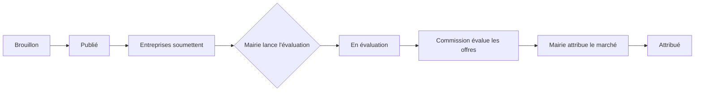
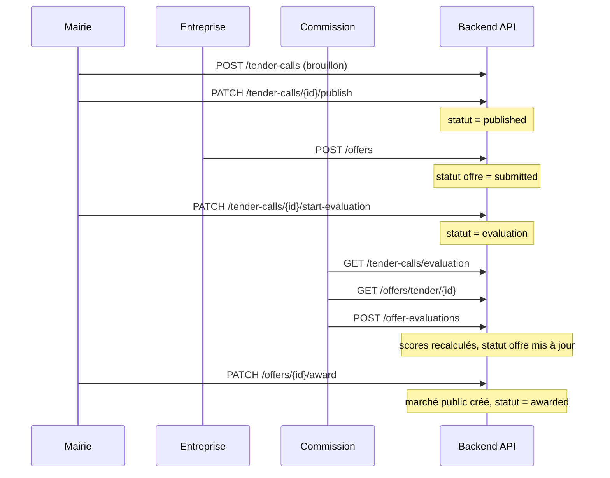

# Logique d'évaluation des offres

Ce document décrit le workflow d'évaluation des appels d'offres dans l'application **Gestion Appels d'Offres** (Mairie de Goma).

---

## Vue d'ensemble

L'évaluation est une phase distincte du cycle de vie d'un appel d'offres. Elle intervient **après** la réception des offres des entreprises et **avant** l'attribution du marché par la mairie.



---

## Acteurs et responsabilités

| Rôle | Code | Responsabilité dans l'évaluation |
|------|------|--------------------------------|
| **Mairie** (admin / autorité publique) | `admin`, `autorite_publique` | Publier l'appel, recevoir les offres, **lancer l'évaluation**, attribuer le marché |
| **Entreprise** | `entreprise` | Soumettre une offre tant que l'appel est publié et la date limite non dépassée |
| **Commission d'évaluation** | `commission_evaluation` | Consulter les offres reçues et saisir le rapport d'évaluation (scores + conformité) |

### Comptes de test (seed)

| Rôle | Email | Mot de passe |
|------|-------|--------------|
| Mairie (admin) | `admin@mairiegoma.cd` | `Admin@12345` |
| Mairie (autorité) | `autorite@mairiegoma.cd` | `Autorite@12345` |
| Commission | `commission@mairiegoma.cd` | `Commission@12345` |

---

## Workflow détaillé

### Étape 1 — Publication de l'appel d'offres

- **Qui :** mairie (`admin` ou `autorite_publique`)
- **Action :** créer puis publier un appel d'offres
- **Statut appel :** `draft` → `published`
- **Condition :** la date limite doit être dans le futur

### Étape 2 — Soumission des offres par les entreprises

- **Qui :** entreprise (`entreprise`)
- **Quand :** uniquement si l'appel est **`published`**
- **Conditions backend** (`offer_service.submit_offer`) :
  - l'appel d'offres existe ;
  - statut = `published` ;
  - date limite **non dépassée** ;
  - une seule offre par entreprise et par appel.
- **Statut offre à la création :** `submitted`

> **Important :** sans offre soumise, la commission n'a rien à évaluer. La liste des offres sera vide.

### Étape 3 — Lancement de l'évaluation (mairie)

- **Qui :** mairie uniquement
- **Action :** bouton **« Lancer évaluation »** sur la fiche ou la liste des offres de l'appel
- **API :** `PATCH /api/tender-calls/{id}/start-evaluation`
- **Conditions** (`tender_call_service.start_evaluation`) :
  - statut actuel = `published` **ou** `closed` ;
  - si encore `published` et date limite non dépassée → clôture automatique puis passage en évaluation ;
  - statut final = **`evaluation`**

Après cette étape, l'appel apparaît dans le menu **« Appels à évaluer »** de la commission.

### Étape 4 — Évaluation par la commission

- **Qui :** `commission_evaluation`
- **Parcours UI :**
  1. `/commission/tender-calls` — liste des appels en statut `evaluation`
  2. `/commission/tender-calls/{id}/offers` — offres reçues pour cet appel
  3. `/commission/offers/{id}/evaluate` — formulaire d'évaluation d'une offre

- **Données saisies** (`EvaluationForm`) :
  - score technique (nombre ≥ 0)
  - score financier (nombre ≥ 0)
  - conformité au DAO (recommandation)
  - rapport / commentaire

- **API création :** `POST /api/offer-evaluations`

- **Condition obligatoire** (`offer_evaluation_service._ensure_tender_in_evaluation`) :
  - l'appel d'offres lié à l'offre doit être en statut **`evaluation`**
  - sinon erreur 400 : *« L'appel d'offres doit être en phase d'évaluation »*

### Étape 5 — Attribution du marché (mairie)

- **Qui :** mairie
- **Quand :** après évaluation des offres
- **Action :** attribuer l'offre retenue
- **API :** `PATCH /api/offers/{id}/award`
- **Effets** (`offer_service.award_offer`) :
  - offre choisie → `awarded`
  - autres offres du même appel → `rejected`
  - appel d'offres → `awarded`
  - création d'un **marché public** (`PublicContract`)

---

## Statuts de l'appel d'offres

| Statut | Signification | Visible commission |
|--------|---------------|-------------------|
| `draft` | Brouillon, non publié | Non |
| `published` | Ouvert aux soumissions | Non |
| `closed` | Clôturé (soumissions terminées) | Non (tant que l'évaluation n'est pas lancée) |
| `evaluation` | Phase d'évaluation en cours | **Oui** |
| `awarded` | Marché attribué | Non |
| `cancelled` | Annulé | Non |

La liste commission (`GET /api/tender-calls/evaluation`) ne retourne que les appels en statut **`evaluation`**.

---

## Statuts des offres

| Statut | Signification |
|--------|---------------|
| `submitted` | Offre déposée, en attente d'évaluation |
| `under_review` | En analyse (recommandation « conforme avec réserves ») |
| `accepted` | Évaluation favorable (conforme) |
| `rejected` | Évaluation défavorable (non conforme) ou non retenue à l'attribution |
| `awarded` | Offre retenue pour le marché |

### Impact de la recommandation d'évaluation

Lors de l'enregistrement d'une évaluation, le statut de l'offre est mis à jour automatiquement selon la **dernière** évaluation enregistrée :

| Recommandation | Libellé UI | Statut offre |
|----------------|------------|--------------|
| `favorable` | Conforme (évaluation positive) | `accepted` |
| `unfavorable` | Non conforme (évaluation négative) | `rejected` |
| `reserve` | Conforme avec réserves | `under_review` |

---

## Calcul des scores

Pour chaque offre, le backend recalcule les scores après chaque création, modification ou suppression d'évaluation :

```
score_technique  = moyenne des technical_score de toutes les évaluations
score_financier  = moyenne des financial_score de toutes les évaluations
score_total      = score_technique + score_financier
```

Fichier : `backend/app/services/offer_evaluation_service.py` → `_recalculate_offer_scores`

Plusieurs membres de la commission peuvent évaluer la même offre ; les scores sont **moyennés**, mais le statut final suit la **recommandation la plus récente**.

---

## Permissions API (commission)

Rôle `commission_evaluation` — permissions seed :

- `tender:read`
- `offer:read_all`
- `offer:evaluate`
- `dao:read`
- `offer_document:read`

### Endpoints utilisés par la commission

| Méthode | Endpoint | Description |
|---------|----------|-------------|
| `GET` | `/api/tender-calls/evaluation` | Appels en phase d'évaluation |
| `GET` | `/api/tender-calls/{id}` | Détail d'un appel (si `evaluation` ou `closed`) |
| `GET` | `/api/offers/tender/{tender_call_id}` | Offres d'un appel |
| `GET` | `/api/offers/{offer_id}` | Détail d'une offre |
| `POST` | `/api/offer-evaluations` | Créer une évaluation |
| `GET` | `/api/offer-evaluations/offer/{offer_id}` | Historique des évaluations d'une offre |
| `GET` | `/api/offer-documents/offer/{offer_id}` | Documents joints à l'offre |

### Endpoints réservés à la mairie (non commission)

| Action | Endpoint |
|--------|----------|
| Lancer l'évaluation | `PATCH /api/tender-calls/{id}/start-evaluation` |
| Attribuer le marché | `PATCH /api/offers/{id}/award` |
| Publier / clôturer | `PATCH /api/tender-calls/{id}/publish` / `close` |

---

## Pages frontend

### Mairie

| Page | Route | Action |
|------|-------|--------|
| Mes appels d'offres | `/authority/tender-calls` | Liste + lancer évaluation |
| Détail appel | `/authority/tender-calls/{id}` | Publier, clôturer, lancer évaluation |
| Offres reçues | `/authority/tender-calls/{id}/offers` | Voir les offres, lancer évaluation |
| Attribution | `/authority/tender-calls/{id}/award` | Attribuer le marché |

### Commission

| Page | Route | Action |
|------|-------|--------|
| Appels à évaluer | `/commission/tender-calls` | Liste des appels en `evaluation` |
| Offres à évaluer | `/commission/tender-calls/{id}/offers` | Liste des offres + lien évaluer |
| Formulaire | `/commission/offers/{id}/evaluate` | Saisie scores et rapport |

### Entreprise

| Page | Route | Action |
|------|-------|--------|
| Appels publiés | `/company/tender-calls` | Consulter les appels ouverts |
| Soumettre offre | `/company/tender-calls/{id}/submit-offer` | Déposer une offre |

---

## Schéma de séquence



---

## Cas limites et erreurs fréquentes

### Liste d'offres vide pour la commission

**Cause :** aucune entreprise n'a soumis d'offre avant le lancement de l'évaluation.

**Solution :** connectez une entreprise, soumettez une offre sur un appel **publié** (date limite valide), puis relancez le parcours.

### « Accès refusé » (commission)

**Cause possible :** navigation vers une route mairie (`/authority/...`) au lieu d'une route commission (`/commission/...`).

**Solution :** utiliser le menu **Appels à évaluer** et le bouton **Consulter** ; les liens commission pointent vers `/commission/tender-calls/...`.

### Impossible d'enregistrer l'évaluation (400)

**Cause :** l'appel n'est plus en statut `evaluation` (retour en arrière manuel en base, ou appel clôturé sans lancement d'évaluation).

**Solution :** la mairie doit cliquer sur **Lancer évaluation**.

### Entreprise ne peut plus soumettre

**Cause :** l'appel n'est plus `published`, ou la date limite est dépassée.

**Règle :** les soumissions sont **bloquées** dès que l'appel n'est plus publié. Il faut soumettre **avant** le lancement de l'évaluation.

### Attribution refusée

**Causes possibles** (`award_offer`) :
- appel non éligible (statut hors `published`, `evaluation`, `closed`) ;
- offre non éligible (statut hors `submitted`, `under_review`, `accepted`) ;
- marché déjà attribué pour cet appel.

---

## Fichiers source principaux

| Couche | Fichier | Rôle |
|--------|---------|------|
| Backend | `app/services/tender_call_service.py` | `start_evaluation`, liste pour commission |
| Backend | `app/services/offer_service.py` | Soumission et attribution des offres |
| Backend | `app/services/offer_evaluation_service.py` | Logique d'évaluation et scores |
| Backend | `app/routes/tender_call_routes.py` | Routes appels + start-evaluation |
| Backend | `app/routes/offer_evaluation_routes.py` | CRUD évaluations |
| Frontend | `pages/authority/TenderOffersPage.tsx` | Lancer évaluation (mairie) |
| Frontend | `pages/commission/EvaluationOffersPage.tsx` | Liste et formulaire commission |
| Frontend | `components/evaluations/EvaluationForm.tsx` | Formulaire de rapport |

---

## Résumé en une phrase

> Les entreprises déposent leurs offres sur un appel **publié** ; la mairie **lance l'évaluation** ; la commission **note et juge la conformité** de chaque offre reçue ; la mairie **attribue le marché** à l'offre retenue.
