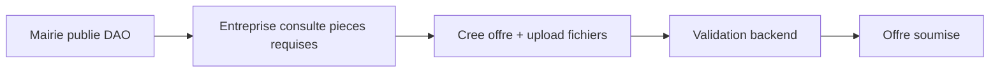

# Soumission d'offre et conformité DAO

Ce document décrit le parcours entreprise pour déposer une offre et la validation des pièces exigées par le DAO.

---

## Vue d'ensemble



---

## Pièces obligatoires (DAO)

La mairie définit les documents obligatoires via des **cases à cocher** lors de la création ou mise à jour du DAO (`required_document_types`).

Types disponibles (alignés sur `OfferDocumentType`) :

| Code | Libellé |
|------|---------|
| `offre_technique` | Offre technique |
| `offre_financiere` | Offre financière |
| `rccm` | RCCM |
| `attestation_fiscale` | Attestation fiscale |
| `identification_nationale` | Identification nationale |
| `preuve_experience` | Preuve d'expérience |
| `autre` | Autre |

Le champ texte `pieces_exigees` reste disponible comme **description complémentaire** pour la commission et l'entreprise.

---

## Parcours entreprise

### Page : `/company/tender-calls/{id}/submit-offer`

1. Chargement du DAO de l'appel (`GET /api/dao-documents/tender/{tender_call_id}`)
2. Affichage des pièces obligatoires et du texte `pieces_exigees`
3. Saisie du montant et de la devise (`OfferForm`)
4. Upload obligatoire d'un fichier par type requis (`RequiredDocumentsUpload`)
5. À la soumission :
   - `POST /api/offers` — création de l'offre
   - `POST /api/offer-documents/offer/{id}/upload` — un appel par document
   - `POST /api/offers/{id}/validate-documents` — vérification finale

Si un document manque, l'API renvoie **400** avec la liste des types manquants.

---

## Validation backend

Fichier : `backend/app/services/offer_service.py`

- `check_offer_documents(db, offer_id)` — compare `dao_documents.required_document_types` aux `offer_documents.document_type` uploadés
- `validate_offer_documents(db, offer_id)` — lève une erreur 400 si incomplet

Route : `POST /api/offers/{offer_id}/validate-documents` (entreprise propriétaire de l'offre).

---

## Accès public au DAO

Pour les appels **publiés**, le DAO est lisible sans authentification (`GET /api/dao-documents/tender/{id}`), afin que la page publique de détail affiche les pièces requises.

---

## Impact sur le score technique

Lors de l'évaluation, le score technique est calculé automatiquement :

```
score_technique = (nb_types_requis_fournis / nb_types_requis_DAO) × 100
```

Si aucune pièce n'est définie dans le DAO : score technique = **100** (pas de pénalité).

Voir aussi : [logique-evaluation.md](./logique-evaluation.md).

---

## Fichiers source

| Couche | Fichier |
|--------|---------|
| Backend | `app/models/dao_document.py` |
| Backend | `app/services/offer_service.py` |
| Backend | `app/routes/offer_routes.py` |
| Frontend | `pages/company/SubmitOfferPage.tsx` |
| Frontend | `components/offers/RequiredDocumentsUpload.tsx` |
| Frontend | `components/dao/DaoDocumentForm.tsx` |
